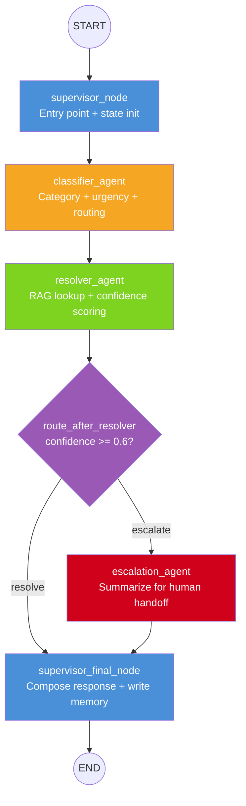

# UDA-Hub Architecture Design

## System Overview

UDA-Hub is a LangGraph-powered multi-agent decision system that processes customer support tickets through a pipeline of specialized agents. Each ticket flows through classification, resolution attempt (with RAG), and either resolution or escalation - with long-term memory accumulating across sessions.

The system is designed for CultPass, a cultural experience subscription platform, but is architected to be account-agnostic via the UDA-Hub multi-tenant data model.

## Agent Graph



### Node Descriptions

1. **supervisor_node** - Entry point. Receives raw ticket input, initializes state, loads long-term memory from `ConversationMemory` table via keyword/category matching.
2. **classifier_agent** - Reads ticket text + metadata. Uses LLM structured output to assign category, urgency, and routing label.
3. **resolver_agent** - Performs RAG against the Knowledge base (keyword/tag search). Selects best matching article, generates response, computes confidence score (0.0–1.0).
4. **route_after_resolver** - Conditional edge. If confidence >= 0.6 -> resolve. If < 0.6 -> escalate.
5. **escalation_agent** - Generates structured escalation summary for human handoff when resolver confidence is low.
6. **supervisor_final_node** - Composes the final assistant response from resolution or escalation data. Writes long-term memory record. Appends to agent trace.

## Agent Specifications

### SupervisorAgent

| Property | Value |
|---|---|
| **File** | `solution/agentic/agents/supervisor_agent.py` |
| **Node functions** | `supervisor_node` (entry), `supervisor_final_node` (exit) |
| **Role** | Entry point that initializes state and loads long-term memory. Final node that composes the response and persists memory. |
| **Inputs** | Raw ticket text, user email, thread_id |
| **Outputs** | Populated `memory_context` (entry), final `messages` + `ConversationMemory` write (exit) |
| **Tools** | None |
| **LLM** | Used for composing final response only |

### ClassifierAgent

| Property | Value |
|---|---|
| **File** | `solution/agentic/agents/classifier_agent.py` |
| **Node function** | `classifier_node` |
| **Role** | Analyze ticket text + metadata to assign category, urgency, and routing label |
| **Inputs** | `ticket_text`, `user_email`, `memory_context` |
| **Outputs** | Updates `classification` in state |
| **Tools** | None |
| **LLM** | Primary - uses structured output parsing |

**Classification categories:**

- `billing` - charges, refunds, payment issues
- `account` - login, password, profile, email changes
- `technical` - app crashes, QR code issues, streaming problems
- `subscription` - plan changes, upgrades, downgrades
- `content` - experience ratings, reviews, feature questions
- `onboarding` - getting started, app setup, first use

**Urgency levels:**

- `high` - financial loss, account lockout, data breach keywords
- `medium` - subscription changes, technical issues with workaround
- `low` - how-to questions, feature inquiries, general info

### ResolverAgent

| Property | Value |
|---|---|
| **File** | `solution/agentic/agents/resolver_agent.py` |
| **Node function** | `resolver_node` |
| **Role** | Perform RAG against knowledge base, compute confidence, attempt resolution |
| **Inputs** | `ticket_text`, `classification`, `memory_context` |
| **Outputs** | Updates `resolution` in state: `{status, article_id, article_title, response, confidence}` |
| **Tools** | `kb_search` (MCP, loaded via `langchain-mcp-adapters`) |
| **LLM** | Used for RAG response generation + confidence scoring |

### EscalationAgent

| Property | Value |
|---|---|
| **File** | `solution/agentic/agents/escalation_agent.py` |
| **Node function** | `escalation_node` |
| **Role** | Generate structured escalation summary for human handoff |
| **Inputs** | `ticket_text`, `classification`, `resolution` (partial), `memory_context` |
| **Outputs** | Updates `escalation` in state: `{reason, priority, customer_context, suggested_actions}` |
| **Tools** | None |
| **LLM** | Used for generating escalation summary |

## Routing Decision Table

| Ticket Characteristic | Category | Urgency | Route |
|---|---|---|---|
| "I was charged twice" | billing | high | resolver -> likely escalate |
| "Can't log in, forgot password" | account | medium | resolver -> resolve |
| "App crashes when reserving" | technical | medium | resolver -> resolve if KB match |
| "I want to upgrade to premium" | subscription | low | resolver -> resolve |
| "How do I leave a review?" | content | low | resolver -> resolve |
| "How do I get started?" | onboarding | low | resolver -> resolve |
| "I want a full refund and to cancel" | billing | high | escalation |
| "My account was hacked" | account | high | escalation |
| Complex multi-issue tickets | mixed | high | resolver -> low confidence -> escalation |

## Confidence Scoring Specification

The confidence score is assigned by the LLM in the ResolverAgent.

**Threshold routing:**

| Score | Action | Meaning |
|---|---|---|
| 0.8-1.0 | Resolve | Strong KB match, high certainty |
| 0.6-0.79 | Resolve | Good match, adequate information |
| 0.3-0.59 | Escalate | Partial match, uncertain resolution |
| 0.0-0.29 | Escalate | No relevant article found |

## Memory Strategy

### Short-Term Memory (Session)

| Property | Value |
|---|---|
| **Storage** | LangGraph `MemorySaver` checkpointer |
| **Scope** | Thread ID (ticket_id passed as thread_id) |
| **Contents** | Message history, intermediate agent outputs |
| **Access** | Automatic via state in workflow nodes |
| **Lifetime** | Duration of one session |

### Long-Term Memory (Cross-Session)

| Property | Value |
|---|---|
| **Storage** | `ConversationMemory` table in UDA-Hub SQLite DB |
| **Schema** | memory_id, account_id, ticket_id, summary, embedding, category, resolution_type, created_at |
| **Write trigger** | After successful resolution or escalation (in `supervisor_final_node`) |
| **Read trigger** | At session start (in `supervisor_node`) |
| **Retrieval method** | SQL LIKE queries on category + keyword overlap in summary |
| **Limit** | Top 5 most relevant past interactions |

## Logging Strategy

### Log Format

Every agent step emits a single JSON line to stdout.

### What Gets Logged at Each Node

| Node | Actions Logged |
|---|---|
| `supervisor_node` | `ticket_received`, `memory_loaded` |
| `classifier_node` | `classify_ticket` (category, urgency, routing) |
| `resolver_node` | `kb_search`, `confidence_score`, `resolve_or_escalate` |
| `escalation_node` | `escalation_created` (priority, reason) |
| `supervisor_final_node` | `response_composed`, `memory_written`, `session_complete` |
| `route_after_resolver` | `routing_decision` |

## Tool Specifications

### account_lookup

| Property | Value |
|---|---|
| **File** | `solution/agentic/tools/account_lookup_tool.py` |
| **MCP Server** | `FastMCP("account_lookup")` |
| **Input** | `email` OR `user_id` |
| **Output** | User + subscription info + open ticket count |
| **DBs accessed** | `cultpass.db` + `udahub.db` |

### process_refund

| Property | Value |
|---|---|
| **File** | `solution/agentic/tools/refund_tool.py` |
| **MCP Server** | `FastMCP("refund_tool")` |
| **Input** | `ticket_id`, `amount`, `reason` |
| **Output** | Refund approval status + details |
| **DBs accessed** | `udahub.db` |

### kb_search

| Property | Value |
|---|---|
| **File** | `solution/agentic/tools/kb_search_tool.py` |
| **MCP Server** | `FastMCP("kb_search")` |
| **Input** | `ticket_text`, `category`, `account_id` |
| **Output** | List of matching Knowledge articles with scores (min score 4) |
| **DBs accessed** | `udahub.db` |
| **Used by** | `resolver_agent` via `langchain-mcp-adapters` |

### read_memory / write_memory

| Property | Value |
|---|---|
| **File** | `solution/agentic/tools/memory_tool.py` |
| **MCP Server** | `FastMCP("memory_tool")` |
| **Input** | `category`, `ticket_text`, `limit`, `account_id` (read); `ticket_id`, `summary`, `category`, `resolution_type`, `account_id` (write) |
| **Output** | List of memory records (read); write confirmation (write) |
| **DBs accessed** | `udahub.db` |
| **Used by** | `supervisor_agent` via `langchain-mcp-adapters` |

## Folder Structure

```
solution/
├── agentic/
│   ├── agents/
│   │   ├── __init__.py
│   │   ├── classifier_agent.py
│   │   ├── resolver_agent.py
│   │   ├── escalation_agent.py
│   │   └── supervisor_agent.py
│   ├── design/
│   │   └── architecture.md
│   ├── tools/
│   │   ├── __init__.py
│   │   ├── account_lookup_tool.py
│   │   ├── refund_tool.py
│   │   ├── kb_search_tool.py
│   │   └── memory_tool.py
│   └── workflow.py
├── data/
│   ├── core/
│   ├── external/
│   │   ├── cultpass_articles.jsonl
│   │   ├── cultpass_experiences.jsonl
│   │   └── cultpass_users.jsonl
│   └── models/
│       ├── __init__.py
│       ├── cultpass.py
│       └── udahub.py
├── tests/
│   ├── __init__.py
│   ├── test_classifier.py
│   ├── test_resolver.py
│   ├── test_tools.py
│   └── test_workflow.py
├── 01_external_db_setup.ipynb
├── 02_core_db_setup.ipynb
├── 03_agentic_app.py
├── utils.py
├── requirements.txt
└── .env.example
```
